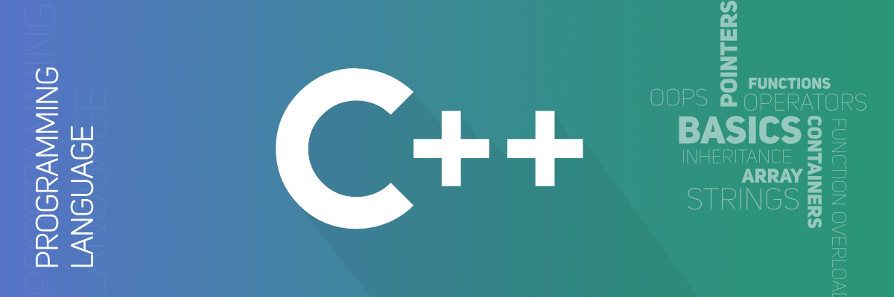

# CS3 - Intro to Algorithms
- Spring 2020
- Chris Stromberg

 

## Assignments

# 1 [Falling Apart](FallingApart/fallingApart.cpp)
- Solved using vector and sort function and accepted (50 points)
- Wrote and tested 3 test cases (3*10 = 30 points)
- [Screenshot screenshot.jpg added (10 points)](FallingApart/Screenshot.jpg)
- total points = 100/100

# 2 [Babelfish](Babelfish/Babelfish.cpp)
- Solved using map and accepted (50 points)
- Wrote and tested 3 test cases (3*10 = 30 points)
- [Screenshot screenshot.jpg added (10 points)](Babelfish/screenshot.jpg)
- total points = 100/100

# 3 [CD](CD/main.cpp)
- Solved using vectors, binary_search(), and accepted (50 points)
- Wrote and tested 3 test cases (3*10 = 30 points)
- [Screenshot screenshot.jpg added (10 points)](CD/screenshot.jpg)
- total points = 100/100

# 4 [Putovanje](Putovanje/putovanje.cpp)
- Solved using vectors, and accepted (50 points)
- Wrote and tested 3 test cases (3*10 = 30 points)
- [Screenshot screenshot.jpeg added (10 points)](Putocanje/sceenshot.jpeg)
- total points = 100/100

# 5 [ICPC](ICPC/icpc.cpp)
- Solved using math.h, and accepted (50 points)
- Wrote and tested 3 test cases (3*10 = 30 points)
- [Screenshot screenshot.jpg added (10 points)](ICPC/screenshot.jpg)
- total points = 100/100

# 6 Binary Search Tree
- Finished 
- [Main file](BST/main.cpp)
- [Implimintation file](BST/bst.cpp)
- [Header file](BST/bst.h)
- total points = 100/100